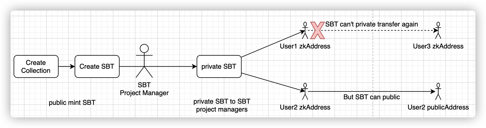

## 基本资料

项目名称：zkNFT

项目立项日期 (哪年哪月)：2022-11

## 项目整体简介

项目简介，英文提交。包括但不限于：

- 项目背景/原由/要解决的问题 (如有其他附件，可放到 `docs` 目录内。英文提交)。
- 项目介绍
- 项目Demo
- 技术架构
- 项目 logo (如有)，这 logo 会印制在文宣，会场海报或贴子上。

Introduce

- a zk privacy nft project based on manta, beside public nft mint and transfer, user can also private their nft transfer. 
- Current manta only support asset privacy, by integration pallet_uniques or other NFT standard with manta-pay, we can support NFT privacy. and we can expand this idea to croos chain nft privacy if we want. 
- pallet_uniques used for NFT behaviour, and adding support NFT on manta-pay, integrationn NFT with asset-manager, also works with manta-sdk to make e2e works.

Architecture:

This product leverage some manta existing architecture but expand it more flexible, in the manta-pay pallet, we support integrate pallet_uniques, this pallets is useful for NFT and SBT features. Given an example of mint NFT,
once transaction is signed successful, the NFT image will be upload to IPFS, and NFT will handled by pallet_uniques and update related metadata infomration.

Components:

We abstract a common ProxyLedger which done some basic common behaviour, and for different asset type, we implements different TransferLedger. Using this feature, we can even support NFT airdrop and more than that.

For example, for sbt that first mint by project manager, after private SBT, project manager can private transfer SBT to users, but user cann't private transfer SBT, because SBT don't allow to transfer. Here is a basic workflow(although not implements complete):

## 黑客松期间计划完成的事项

- 请团队在报名那一周 git clone 这个代码库并创建团队目录，在 readme 里列出黑客松期间内打算完成的代码功能点。并提交 PR 到本代码库。例子如下 (这只是一个 nft 项目的例子，请根据团队项目自身定义具体工作)：

**区块链端**

- `pallet-nft`
  - [x] NFT Private Mint
  - [x] NFT Private Transfer
  - [x] NFT Public Transfer

**客户端**

- web 端
  - [x] NFT Collection Create
  - [x] NFT Item Mint
  - [x] NFT ToPrivate Transact
  - [x] NFT PrivateTransfer Transact
  - [x] NFT PublicTransfer Transact
  - [x] NFT View Public
  - [x] NFT View Private  

## 黑客松期间所完成的事项 (2022年12月27日初审前提交)

- 2022年12月27日前，在本栏列出黑客松期间最终完成的功能点。
- 把相关代码放在 `src` 目录里，并在本栏列出在黑客松期间打完成的开发工作/功能点。我们将对这些目录/档案作重点技术评审。
- 放一段不长于 **5 分钟** 的产品 DEMO 展示视频, 命名为 `团队目录/docs/demo.mp4`。初审时这视频是可选，demo day 这是计分项。

## 队员信息

包含参赛者名称及介绍
在团队中担任的角色
GitHub 帐号
微信账号（如有请留下，方便及时联系）

- dots2048: Backend
- Alex: Frontend